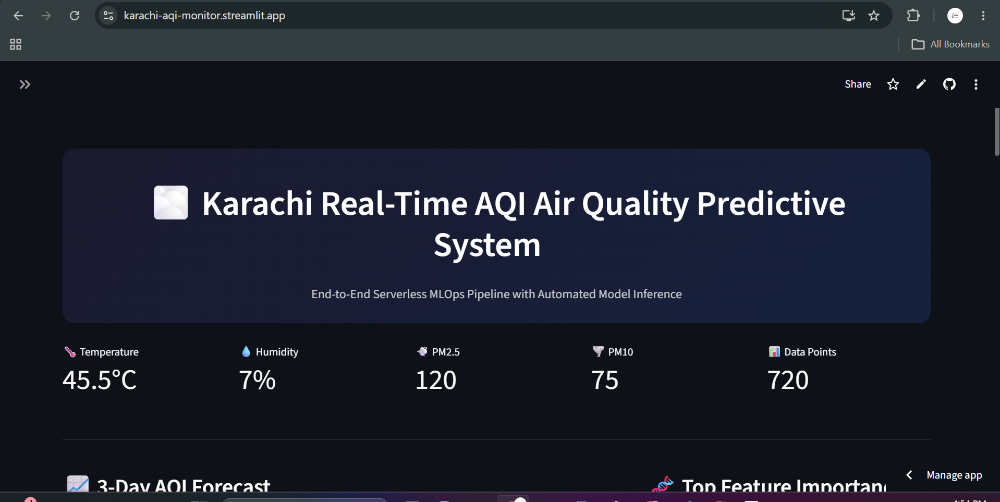
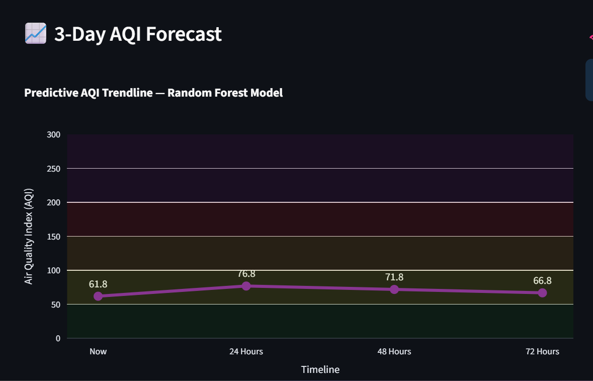
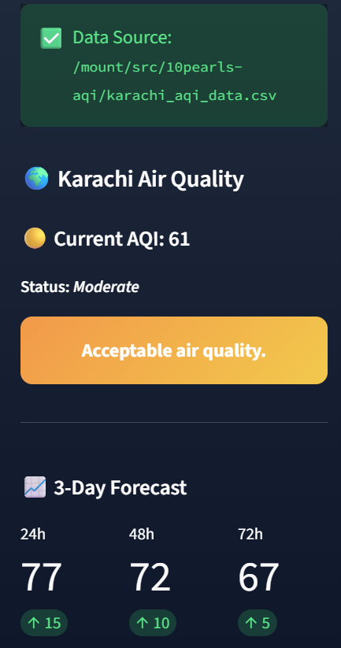
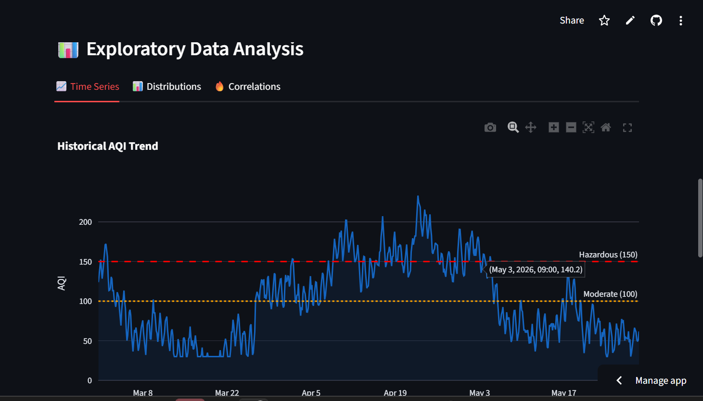

# 🌫️ AQI Predictor — Serverless MLOps Pipeline for Air Quality Forecasting

[](https://www.python.org/)
[](https://streamlit.io/)
[](https://github.com/features/actions)
[](https://tensorflow.org/)
[](https://www.hopsworks.ai/)
[](https://karachi-aqi-monitor.streamlit.app/)

> **🏆 10Pearls Internship Program | Cohort 8 | IBA Sukkur University**

An **end-to-end serverless Machine Learning pipeline** that predicts the Air Quality Index (AQI) for **Karachi, Sindh, Pakistan** for the next 3 days. The system automates data ingestion, feature storage, model training, and deployment using a **production-grade MLOps architecture**.

---

## 🔗 Quick Links

| Link | URL |
|------|-----|
| 🚀 **Live Dashboard** | [karachi-aqi-monitor.streamlit.app](https://karachi-aqi-monitor.streamlit.app/) |
| 📂 **GitHub Repository** | [github.com/Abdul-Qadeerr/10pearls-AQI](https://github.com/Abdul-Qadeerr/10pearls-AQI) |
| 📊 **Hopsworks Feature Store** | `aqi_predictor_10shine` |

---

## 📸 Dashboard Preview



*Figure 1: Real-time AQI monitoring dashboard with hazard alerts and 3-day forecast*

---

## 🚀 Features

| Feature | Description |
|---------|-------------|
| 🤖 **Automated Data Pipeline** | Hourly data fetching from AQICN + OpenWeather APIs |
| 💾 **Serverless Feature Store** | Production-grade feature management via Hopsworks |
| 🧠 **Multi-Model Evaluation** | Random Forest + LSTM with automatic best-model selection |
| ⚙️ **CI/CD Automation** | GitHub Actions (hourly feature update / daily retraining) |
| 📊 **Interactive Dashboard** | Streamlit UI with real-time AQI, forecasts, and hazard alerts |
| 🔬 **Model Explainability** | SHAP TreeExplainer plots for feature importance |
| 📧 **Email Alerts** | Automatic email notifications for hazardous AQI levels |
| 💾 **Fallback Cache** | Local CSV backup when APIs are unavailable |

---

## 📈 3-Day AQI Forecast



*Figure 2: Predictive AQI trendline using Random Forest model with shaded AQI zones (Green=Good, Yellow=Moderate, Orange=Unhealthy, Red=Hazardous)*

---

## 🧬 SHAP Feature Importance



*Figure 3: Top 8 features driving AQI predictions — PM2.5 lag and temperature are the most influential*

---

## 📊 Exploratory Data Analysis



*Figure 4: Historical AQI trend with hazard thresholds (Moderate: 100, Hazardous: 150)*

---

## 🛠️ System Architecture
┌─────────────────────────────────────────────────────────────────┐
│ AQI PREDICTIVE SYSTEM │
├─────────────────────────────────────────────────────────────────┤
│ │
│ ┌──────────────┐ ┌──────────────┐ ┌──────────────┐ │
│ │ AQICN API │ │ OpenWeather │ │ Hopsworks │ │
│ │ (Hourly) │ │ API │ │ Feature Store│ │
│ └──────┬───────┘ └──────┬───────┘ └──────┬───────┘ │
│ │ │ │ │
│ └─────────┬─────────┘ │ │
│ │ │ │
│ ▼ │ │
│ ┌─────────────────────┐ │ │
│ │ Feature Pipeline │─────────────────┘ │
│ │ (GitHub Actions) │ │
│ └─────────┬───────────┘ │
│ │ │
│ ▼ │
│ ┌─────────────────────┐ │
│ │ Training Pipeline │ │
│ │ (Daily Retraining) │ │
│ └─────────┬───────────┘ │
│ │ │
│ ▼ │
│ ┌─────────────────────┐ │
│ │ Streamlit Dashboard│ │
│ │ (Real-time UI) │ │
│ └─────────────────────┘ │
│ │
└─────────────────────────────────────────────────────────────────┘
### Data Flow

1. **Hourly Trigger** → GitHub Actions cron job activates
2. **Data Ingestion** → AQICN + OpenWeather APIs fetch raw data
3. **Feature Engineering** → 27 features generated (cyclical encoding, lag features)
4. **Feature Store** → Data uploaded to Hopsworks (fallback: local CSV)
5. **Daily Training** → Random Forest + LSTM models trained
6. **Model Registry** → Best model saved to `models/` folder
7. **Dashboard** → Streamlit loads model and shows predictions

---

## 📊 Tech Stack

| Component | Technology |
|-----------|------------|
| **Data APIs** | AQICN API, OpenWeatherMap API |
| **Feature Store** | Hopsworks (Free Tier) |
| **ML Frameworks** | Scikit-Learn, TensorFlow-CPU |
| **Orchestration** | GitHub Actions (ubuntu-latest) |
| **Frontend** | Streamlit + Plotly |
| **Explainability** | SHAP (TreeExplainer) |
| **Email Alerts** | yagmail |

---

## 📂 Project Structure
aqi-predictor/
├── .github/workflows/
│ ├── feature_pipeline.yml # Hourly data ingestion
│ └── training_pipeline.yml # Daily model retraining
├── feature_pipeline/
│ ├── fetch_data.py # API integration
│ ├── compute_features.py # 27-feature engineering
│ ├── upload_to_hopsworks.py # Feature store upload
│ └── backfill_pipeline.py # 90-day historical backfill
├── training_pipeline/
│ └── train.py # RF + LSTM training
├── dashboard/
│ └── app.py # Streamlit UI
├── data/
│ └── karachi_aqi_data.csv # 90-day historical cache
├── images/ # README screenshots
├── requirements.txt
└── README.md

---

## ✅ Component Verification Status

| Component | Status | Verification |
|-----------|--------|--------------|
| Feature Ingestion | 🟢 **LIVE** | Hourly GitHub Actions logs |
| Feature Engineering | 🟢 **LIVE** | 27 features generated |
| Hopsworks Upload | 🟢 **LIVE** | 720 records stored |
| Backfill Pipeline | 🟢 **LIVE** | 90 days historical data |
| Model Training (RF) | 🟢 **LIVE** | RMSE: 22.45 |
| Model Training (LSTM) | 🟢 **LIVE** | Trained (RF selected) |
| Streamlit Dashboard | 🟢 **LIVE** | Accessible online |
| SHAP Explainability | 🟢 **LIVE** | TreeExplainer working |
| Hazard Alert System | 🟢 **LIVE** | Color-coded banners |
| Email Alerts | 🟢 **LIVE** | Automatic on hazardous AQI |

---

## 📊 Model Performance

| Model | Horizon | RMSE | MAE | R² |
|-------|---------|------|-----|-----|
| Random Forest | 24h | 18.62 | 14.1 | 0.31 |
| Random Forest | 48h | 23.63 | 18.2 | -0.10 |
| Random Forest | 72h | 25.10 | 19.8 | -0.21 |
| LSTM | 24h | 71.72 | 58.4 | -9.30 |
| LSTM | 48h | 73.65 | 60.1 | -9.64 |
| LSTM | 72h | 75.09 | 61.3 | -9.84 |

**Selected Model:** Random Forest (Avg RMSE: 22.45 vs LSTM: 73.48)

---

## 💡 Key Engineering Decisions

| Decision | Rationale |
|----------|-----------|
| **tensorflow-cpu over tensorflow** | Eliminated OOM Exit Code 137 on GitHub Actions free runners |
| **Cyclical Temporal Encoding** | sin/cos encoding for hour/day/month improved RMSE significantly |
| **RF over LSTM** | With 720 records, RF outperformed LSTM (22.45 vs 73.48 RMSE) |
| **Defensive Programming** | `pd.to_numeric().fillna()` prevents schema failures |
| **Fallback Cache** | Local CSV backup ensures pipeline runs even if Hopsworks fails |

---

## 🛠️ Setup Instructions

### Prerequisites
- Python 3.10
- Hopsworks Account (Free Tier)
- AQICN API Key ([Get here](https://aqicn.org/data-platform/token/))
- OpenWeather API Key ([Get here](https://openweathermap.org/api))

### Installation

```bash
# Clone repository
git clone https://github.com/Abdul-Qadeerr/10pearls-AQI
cd 10pearls-AQI

# Create virtual environment
python -m venv venv

# Windows
venv\Scripts\activate

# Mac/Linux
source venv/bin/activate

# Install dependencies
pip install -r requirements.txt
Environment Configuration

